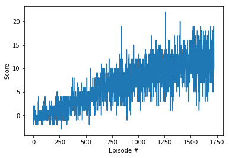

# Bananas RL Project Report

## Algorithm

The environment has 37 states. Four actions are available: forward, backward, left and right.

Two improvements to the basic Q-Learning algorithm are included: experience replay, and fixed Q-targets.


## Outcome

```
Episode 100	Average Score: 0.12
Episode 200	Average Score: 0.62
Episode 300	Average Score: 1.09
Episode 400	Average Score: 2.40
Episode 500	Average Score: 2.94
Episode 600	Average Score: 3.89
Episode 700	Average Score: 5.44
Episode 800	Average Score: 6.29
Episode 900	Average Score: 6.88
Episode 1000	Average Score: 7.91
Episode 1100	Average Score: 8.20
Episode 1200	Average Score: 9.34
Episode 1300	Average Score: 10.03
Episode 1400	Average Score: 9.821
Episode 1500	Average Score: 10.55
Episode 1600	Average Score: 11.34
Episode 1700	Average Score: 11.61
Episode 1722	Average Score: 12.00
Environment solved in 1622 episodes!	Average Score: 12.00
```




## Future Work

I experimented with parameters and this seems to meet the requirements for the class. I'm sure it's possible to do better. 
In particular, I can see in the class forum that some people have achieved results that faster, so there is room for improvement.

This only incorporates the main elements of the DQN algorithm, and borrows heavily from code created for some of the assignments.
In future I would like to add some additional improvements, such as prioritized experience replay and dueling DQN.


An additional, optional assignment to learn directly from pixels is available. It would be interesting to try that to compare the approaches.
