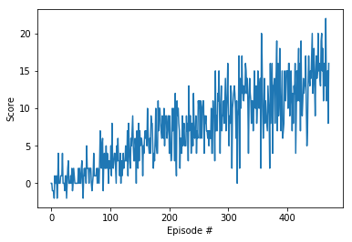

# Bananas RL Project Report

## Environment

This is an example of Deep Q Network reinformcement learning in a simple game environment.
The goal is to pick up as many of the yellow bananas as possible. 
Yellow bananas are rewarded positively, while Blue bananas are penalized.

The environment is provided as a custom Unity project from Udacity, found here in the `Banana_Linux` folder.
The environment has 37 states. Four actions are available: forward, backward, left and right.

Two improvements to the basic Q-Learning algorithm are implemented: experience replay, and fixed Q-targets.

## Model

The model consists of three fully-connected layers, with sizes as follows: 

fc1: input states (37) x 64
fc2: 64 x 64
fc3: 64 x output actions (4)

All other model values are Torch defaults.

The Q-network uses a fairly-typical discount factor of 0.99, and updates every 4 time steps. The major hyperparameter I chose to experiment with is the episode decay parameter. I tried multiple values between 0.999 and 0.985 and found 0.995 to be the best one for learning.


## Outcome

The run I chose to represent here solved the environment (>13) in 371 episodes.

```
Episode 100	Average Score: 1.15
Episode 200	Average Score: 5.15
Episode 300	Average Score: 7.89
Episode 400	Average Score: 10.92
Episode 471	Average Score: 13.04
Environment solved in 371 episodes!	Average Score: 13.04

```




## Future Work

I experimented with parameters and this seems to meet the requirements for the class. I'm sure it's possible to do better. 
In particular, I can see in the class forum that some people have achieved results that faster, so there is room for improvement.

This only incorporates the main elements of the DQN algorithm, and borrows heavily from code created for some of the assignments.
In future I would like to add some additional improvements, such as prioritized experience replay and dueling DQN.


An additional, optional assignment to learn directly from pixels is available. It would be interesting to try that to compare the approaches.
